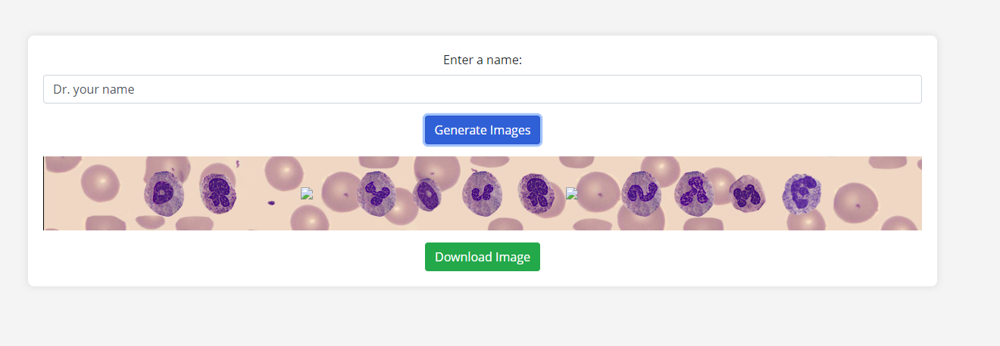
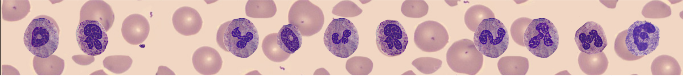

# CellaVision Name Generator

A web app that helps you create an image with your name using WBC cells shaped as English alphabets.

## Description

This is a web app that helps you create your name using WBC cell images collected and shared by CellaVision analyzer users with CellaVision.

## Getting Started

### Dependencies

* You should be connected to internet.
* Works on any desktop or mobile browsers.
* It is responsive so will work with all screen size types.

### How to run program

* Go to [CellaVision Name Generator](https://raka01cv.github.io/responsivecvnamegenerator/) website

* Write your name in the "Enter a name:" box

* Then press the "Generate Images" button to create teh image with your name

* Once the image is generated and you are happy with the output. Then click on the "Download Image" button to download it.

* The final image will be as follows.

## Help

Please feel free to comment here or reach out to me [@RKanjilimadom](https://x.com/RKanjilimadom).

## Author

Rahul Kanjilimadom  
[@RKanjilimadom](https://x.com/RKanjilimadom)

## Version History

* 0.2
    * Various bug fixes and optimizations
    * See [commit change]() or See [release history]()
* 0.1
    * Initial Release

## License

This project and the alphabets cell images are a property of [CellaVision AB](https://https://www.cellavision.com)

## Acknowledgements
*   Mats Erikson  
    [LinkedIn](https://www.linkedin.com/in/mats-erikson-4816418b/)

 *  Appu George
    [LinkedIn](https://www.linkedin.com/in/appu-george-4386529/)

Inspiration, code snippets, etc.
* 